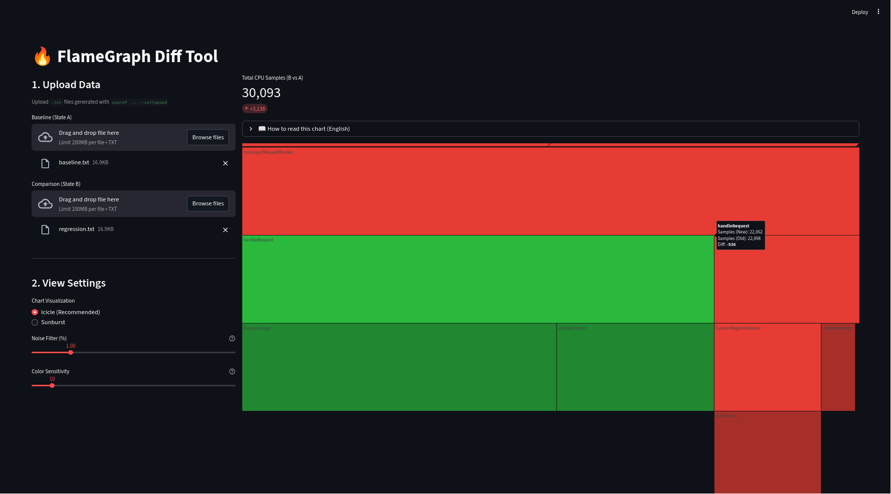

# 🔥 Visual FlameGraph Diff

[](Dockerfile)
[](app.py)
[](LICENSE)

A specialized, interactive visualization tool for analyzing performance regressions in high-load applications.

It compares two **Collapsed Stack** profiles (e.g., from `async-profiler`) and renders a **Differential Icicle Graph**. This allows you to instantly identify CPU usage growth (Regressions) or reduction (Optimizations) without setting up a heavy observability stack.

---

## 📸 Preview



* **Red Blocks:** Regression (Function takes *more* CPU time in the new build).
* **Green Blocks:** Optimization (Function takes *less* CPU time).
* **Grey Blocks:** Stable performance.

---

## ⚡ Quick Start

### Option 1: Run with Docker (Recommended)
No Python installation required. Just run the container and upload your files.

```bash
# 1. Build the image
docker build -t perf-flame-diff .

# 2. Run the container
docker run -p 8501:8501 perf-flame-diff
````

**Open your browser:** [http://localhost:8501](http://localhost:8501)

### Option 2: Run Locally (Python)

```bash
# 1. Create venv
python3 -m venv venv
source venv/bin/activate

# 2. Install deps
pip install -r requirements.txt

# 3. Run
streamlit run app.py
```

-----

## 🧪 Try with Demo Data

Don't have profiles handy? We included synthetic data to demonstrate a "JSON Parsing Regression" scenario.

1.  Launch the tool.
2.  Go to the `demo_data/` folder in this repository.
3.  Upload **`baseline.txt`** to the **"Baseline (A)"** slot.
4.  Upload **`regression.txt`** to the **"Comparison (B)"** slot.
5.  **Observe:** You will see a massive **RED** block indicating a performance issue in `CustomRegexValidator`, simulating a bad code change.

-----

## 🛠 How to Generate Profiles

This tool accepts **Collapsed Stack** format (`.txt`).
Use [async-profiler](https://github.com/async-profiler/async-profiler) to capture data from your Java/Kotlin applications.

### 1\. Capture directly (Linux)

If you have access to the machine:

```bash
# Capture 30 seconds of CPU profile in collapsed format
./asprof -d 30 -o collapsed -f profile.txt <PID>
```

### 2\. Convert from JFR (Any OS)

If you already have `.jfr` recordings (e.g., from Flight Recorder):

```bash
# Using async-profiler's built-in converter (v3.0+)
java -cp lib/converter.jar jfr2flame --collapsed profile.jfr profile.txt
```

-----

## ⚙️ Features

  * **Interactive Visualization:** Zoom in/out, click to drill down into specific stack frames (powered by Plotly).
  * **Differential Logic:** Automatically calculates the delta between two profiles.
  * **Noise Filtering:** Use the "Noise Filter" slider to prune insignificant nodes (\< 1%) to prevent browser lag on deep stacks.
  * **Privacy Friendly:** Runs entirely locally or in your private Docker container. No data leaves your machine.

-----

## 🤝 Contributing

Contributions are welcome\! Please feel free to submit a Pull Request.

## 📄 License

This project is licensed under the MIT License - see the [LICENSE](LICENSE) file for details.